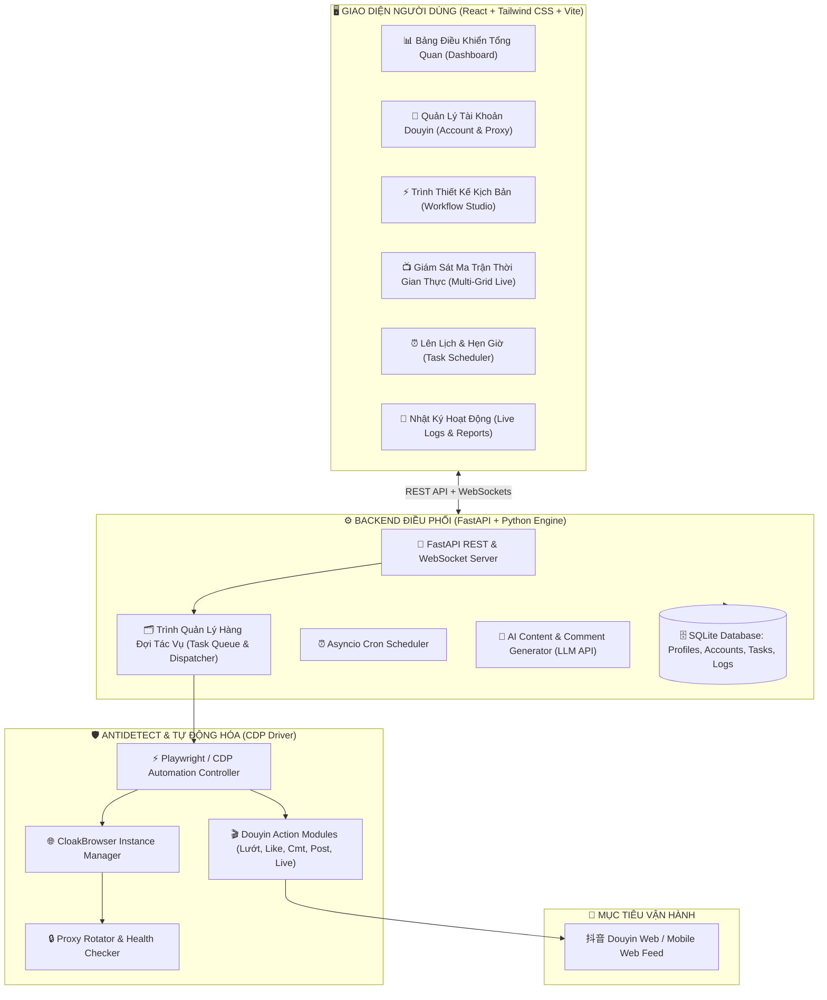
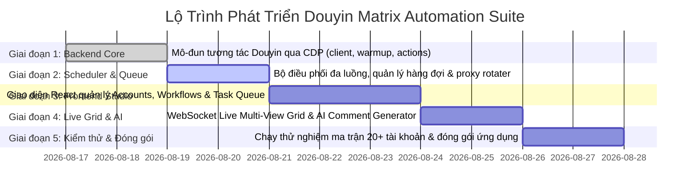

# 抖音 DOUYIN MATRIX AUTOMATION SUITE
## Kế Hoạch Thiết Kế & Bản Vẽ Kiến Trúc Ứng Dụng Tự Động Hóa Ma Trận Douyin

> **Dự án**: Nâng cấp từ nền tảng `CloakBrowser-Manager` (Antidetect Chromium + CDP + FastAPI + React) thành giải pháp **Ma trận tự động hóa Douyin chuyên nghiệp** (Douyin Multi-Account Matrix Automation).

---

## 1. TỔNG QUAN DỰ ÁN

### 1.1. Mục tiêu cốt lõi
1. **Quản lý đa tài khoản độc lập 100%**: Mỗi tài khoản Douyin chạy trên một Profile Antidetect riêng biệt với vân tay thiết bị (Canvas, WebGL, Audio, Client Hints, TLS, Screen) và IP Proxy riêng, không bị Douyin liên kết hoặc quét bất thường.
2. **Kịch bản tự động hóa chuyên sâu (AI-Powered)**:
   - **Nuôi tài khoản (Warm-up)**: Lướt luồng Đề Xuất (`?recommend=1`), xem ngẫu nhiên 5-15s, like 15-20% video, đọc comment, follow kênh.
   - **Tương tác theo từ khóa & Hashtag**: Tìm kiếm theo từ khóa chuyên ngành, quét video top, để lại bình luận thông minh.
   - **Tương tác Livestream**: Vào phòng live chỉ định, thả tim liên tục, xem live, gửi tin nhắn seeding.
   - **Đăng video tự động (Auto Upload)**: Tải video lên Douyin Creator Hub, tự động gắn caption, hashtag, chọn ảnh bìa và hẹn giờ xuất bản.
3. **Giám sát trực quan (Live Multi-View Grid)**: Theo dõi cùng lúc màn hình thu nhỏ của các profile đang lướt Douyin ngay trên Dashboard.
4. **Bộ điều phối đa luồng thông minh (Task Scheduler)**: Cho phép cấu hình số luồng chạy song song (ví dụ: 3-5 tab cùng lúc), tự động xoay vòng danh sách tài khoản theo hàng đợi và khung giờ vàng.

---

## 2. BẢN VẼ KIẾN TRÚC HỆ THỐNG (SYSTEM ARCHITECTURE)



---

## 3. BẢN VẼ BỐ CỤC GIAO DIỆN (UI/UX WIREFRAMES)

### 3.1. Bố cục tổng quan (App Master Layout)

```text
+-------------------------------------------------------------------------------------------------------+
| 抖音 DOUYIN MATRIX AUTOMATION                                           [+ Thêm Acc] [▶ Chạy Kịch Bản]|
+---------------+---------------------------------------------------------------------------------------+
| 📁 Menu       | 📊 Dashboard Thống Kê Ma Trận                                                         |
| --------------|---------------------------------------------------------------------------------------|
| 📊 Tổng quan  | [👥 20 Tài Khoản]  [🟢 6 Đang Chạy]  [🎬 420 Video Đã Xem]  [💬 85 Comment]  [⚠️ 0 Lỗi]     |
| 👥 Tài khoản  |---------------------------------------------------------------------------------------|
| ⚡ Kịch bản   | 📺 GIÁM SÁT MA TRẬN TRỰC TIẾP (LIVE MULTI-VIEW GRID)                                  |
| 🎬 Đăng video | +-----------------------------+  +-----------------------------+  +-----------------+ |
| ⏰ Lịch biểu  | | [Acc #1: ThoiTrang01] 🟢     |  | [Acc #2: MyPhamHot] 🟢      |  | [Acc #3: GiaDung]| |
| 🧠 AI Prompt  | |                             |  |                             |  |                 | |
| ⚙️ Cài đặt    | | ▶ Đang xem: Video #6 (6s)    |  | | ▶ Đang like & comment     |  | | ▶ Đang lướt feed| |
|               | | 🎬 "Cách phối đồ mùa đông..."|  | | 💬 "Sản phẩm đẹp quá ạ"   |  | | 🎬 "Mẹo nhà bếp"| |
|               | +-----------------------------+  +-----------------------------+  +-----------------+ |
|               |---------------------------------------------------------------------------------------|
|               | 📋 DANH SÁCH TÁC VỤ ĐANG CHẠY (ACTIVE TASKS QUEUE)                                   |
|               | ID      Tài Khoản      Kịch Bản          Tiến Độ      Proxy            Hành Động      |
|               | ------------------------------------------------------------------------------------- |
|               | #101    Acc-01 (Mỹ phẩm) Nuôi acc tự nhiên 8/10 Video  103.14.22.1:8080 [Tạm Dừng] [X] |
|               | #102    Acc-02 (Thời trang) Đi cmt theo hashtag 4/15 Cmt    118.27.10.5:8080 [Tạm Dừng] [X] |
+---------------+---------------------------------------------------------------------------------------+
```

### 3.2. Màn hình Quản Lý Tài Khoản (Accounts Center)
- Danh sách tài khoản kèm: Avatar, Nickname, Douyin ID, Số Follower, Trạng thái Cookie (Còn hạn / Hết hạn / Khóa), Proxy đang gắn, Nút mở thủ công / Nút bắt đầu auto.

### 3.3. Màn hình Cấu Hình Kịch Bản (Workflow Studio)
- Chọn loại kịch bản:
  1. `Nuôi tài khoản (Warm-up)`: Số lượng video (ví dụ: 10-50), thời gian xem mỗi video (5-15s), tỷ lệ like (0-100%), tỷ lệ comment (0-100%).
  2. `Tương tác theo Từ khóa / Hashtag`: Nhập danh sách từ khóa (mỗi dòng 1 từ), chọn hành động (Like, Bình luận theo AI, Follow chủ kênh).
  3. `Đi dạo Livestream`: Link phòng live hoặc từ khóa tìm live, thời gian xem (phút), số lần thả tim, nội dung chat seeding.
  4. `Đăng video tự động`: Chọn thư mục video, nhập file danh sách caption/hashtag, thời gian giãn cách giữa các bài đăng.

---

## 4. THIẾT KẾ CƠ SỞ DỮ LIỆU (DATABASE SCHEMA)

```sql
-- 1. Bảng Tài Khoản Douyin liên kết với Profile Antidetect
CREATE TABLE douyin_accounts (
    id TEXT PRIMARY KEY,               -- UUID
    profile_id TEXT NOT NULL,          -- Khóa ngoại liên kết bảng profiles của CloakBrowser
    nickname TEXT,                     -- Tên hiển thị Douyin
    douyin_id TEXT,                    -- ID kênh Douyin
    avatar_url TEXT,                   -- Link ảnh đại diện
    follower_count INTEGER DEFAULT 0,
    following_count INTEGER DEFAULT 0,
    cookie_status TEXT DEFAULT 'unknown', -- 'valid', 'expired', 'banned'
    proxy_url TEXT,                    -- Proxy riêng nếu có
    tags TEXT,                         -- JSON tags phân loại (thời trang, gia dụng...)
    last_active_at TIMESTAMP,
    created_at TIMESTAMP DEFAULT CURRENT_TIMESTAMP,
    FOREIGN KEY(profile_id) REFERENCES profiles(id) ON DELETE CASCADE
);

-- 2. Bảng Kịch Bản Mẫu (Workflows / Campaigns)
CREATE TABLE workflows (
    id TEXT PRIMARY KEY,
    name TEXT NOT NULL,
    action_type TEXT NOT NULL,         -- 'warmup', 'keyword_interact', 'live_seeding', 'video_upload'
    config_json TEXT NOT NULL,         -- Cấu hình chi tiết (số video, thời gian, prompt AI...)
    created_at TIMESTAMP DEFAULT CURRENT_TIMESTAMP
);

-- 3. Bảng Hàng Đợi Tác Vụ (Task Queue)
CREATE TABLE automation_tasks (
    id TEXT PRIMARY KEY,
    workflow_id TEXT NOT NULL,
    account_id TEXT NOT NULL,
    status TEXT DEFAULT 'pending',     -- 'pending', 'running', 'completed', 'failed', 'paused'
    progress_current INTEGER DEFAULT 0,
    progress_total INTEGER DEFAULT 0,
    logs TEXT,                         -- JSON log các bước
    error_message TEXT,
    scheduled_at TIMESTAMP,
    started_at TIMESTAMP,
    finished_at TIMESTAMP,
    FOREIGN KEY(workflow_id) REFERENCES workflows(id),
    FOREIGN KEY(account_id) REFERENCES douyin_accounts(id)
);

-- 4. Bảng Lịch Sử Thao Tác (Action Logs & Analytics)
CREATE TABLE action_logs (
    id INTEGER PRIMARY KEY AUTOINCREMENT,
    task_id TEXT,
    account_id TEXT NOT NULL,
    action_type TEXT NOT NULL,         -- 'watch_video', 'like', 'comment', 'follow', 'upload'
    target_id TEXT,                    -- ID video hoặc ID user tương tác
    content TEXT,                      -- Nội dung comment nếu có
    status TEXT DEFAULT 'success',
    created_at TIMESTAMP DEFAULT CURRENT_TIMESTAMP
);
```

---

## 5. THIẾT KẾ REST API & WEBSOCKET

| Phương thức | Endpoint | Mô tả |
| :--- | :--- | :--- |
| `GET` | `/api/douyin/accounts` | Lấy danh sách tất cả tài khoản Douyin và trạng thái |
| `POST` | `/api/douyin/accounts` | Thêm tài khoản mới (tự tạo Profile Antidetect tương ứng) |
| `POST` | `/api/douyin/accounts/{id}/check-login` | Kiểm tra trạng thái đăng nhập Douyin qua CDP |
| `GET` | `/api/douyin/workflows` | Lấy danh sách kịch bản tự động đã lưu |
| `POST` | `/api/douyin/workflows` | Tạo mới kịch bản (Nuôi acc, Search cmt, Up video...) |
| `POST` | `/api/douyin/tasks/dispatch` | Gửi lệnh chạy kịch bản cho nhóm tài khoản chỉ định |
| `GET` | `/api/douyin/tasks/active` | Xem danh sách các tác vụ đang chạy trong hàng đợi |
| `POST` | `/api/douyin/tasks/{id}/stop` | Dừng hoặc hủy một tác vụ đang chạy |
| `POST` | `/api/douyin/ai/generate-comment` | Gọi AI để sinh comment theo ngữ cảnh video |
| `WS` | `/ws/douyin/live-feed` | WebSocket truyền hình ảnh thu nhỏ & log thời gian thực |

---

## 6. CẤU TRÚC MÃ NGUỒN CẢI TIẾN

```text
anti-browser/CloakBrowser-Manager/
├── backend/
│   ├── main.py                         # API Server chính & WebSocket Live Monitor
│   ├── database.py                     # SQLite mở rộng bảng douyin_accounts, tasks, workflows
│   ├── models.py                       # Pydantic Models cho Douyin Task & Campaign
│   ├── browser_manager.py              # Quản lý trình duyệt CloakBrowser Antidetect
│   ├── douyin/                         # 🌟 THƯ MỤC CHUYÊN BIỆT CHO DOUYIN
│   │   ├── __init__.py
│   │   ├── client.py                   # Lớp tương tác CDP Playwright chuyên cho Douyin
│   │   ├── actions/
│   │   │   ├── warmup.py               # Lướt feed recommend, xem video, like tự nhiên
│   │   │   ├── search_interact.py      # Tìm kiếm từ khóa, cmt theo hashtag
│   │   │   ├── live_interact.py        # Tương tác phòng livestream
│   │   │   └── uploader.py             # Đăng tải video tự động
│   │   ├── ai_generator.py             # Sinh comment & caption bằng AI
│   │   └── scheduler.py                # Quản lý hàng đợi tác vụ đa luồng
├── frontend/
│   ├── src/
│   │   ├── App.tsx                     # Điều hướng các tab: Dashboard, Accounts, Workflows, Live, Settings
│   │   ├── components/
│   │   │   ├── douyin/
│   │   │   │   ├── DouyinAccountTable.tsx   # Danh sách nick Douyin, avatar, trạng thái
│   │   │   │   ├── WorkflowBuilder.tsx      # Giao diện chọn kịch bản (Nuôi nick, cmt, up video)
│   │   │   │   ├── LiveMatrixGrid.tsx       # Xem live màn hình các tab đang lướt
│   │   │   │   ├── TaskQueueMonitor.tsx     # Hàng đợi các tác vụ đang chạy
│   │   │   │   └── AISettingsModal.tsx      # Cấu hình API Key AI sinh comment
```

---

## 7. LỘ TRÌNH TRIỂN KHAI 5 GIAI ĐOẠN



---

*Tài liệu này được lưu trực tiếp tại file: `anti-browser/CloakBrowser-Manager/DOUYIN_AUTOMATION_PLAN.md`.*
